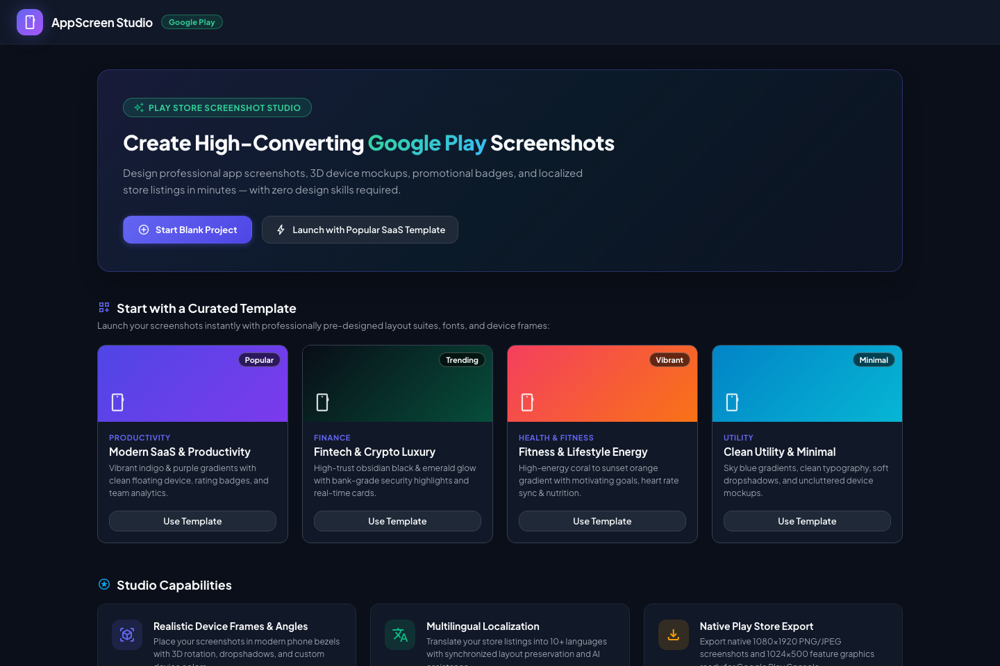
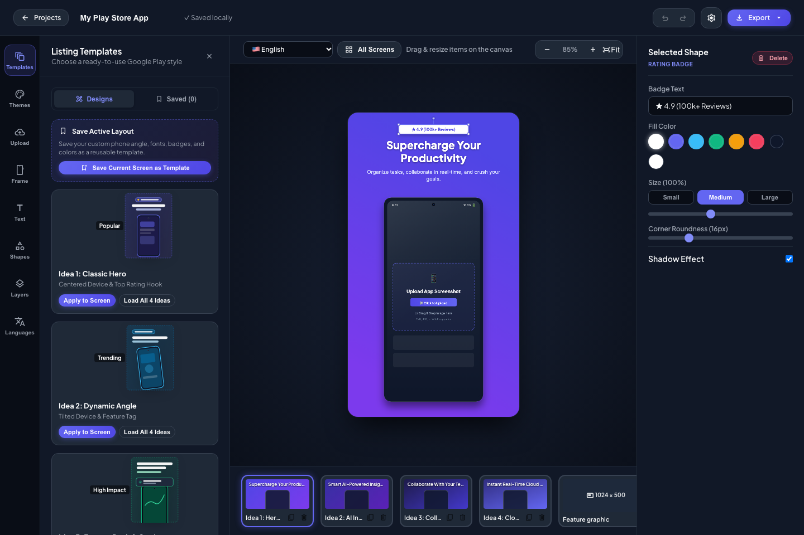
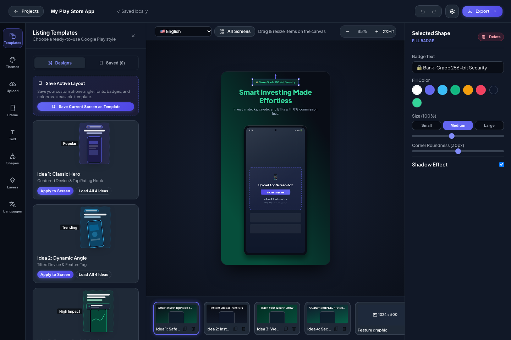
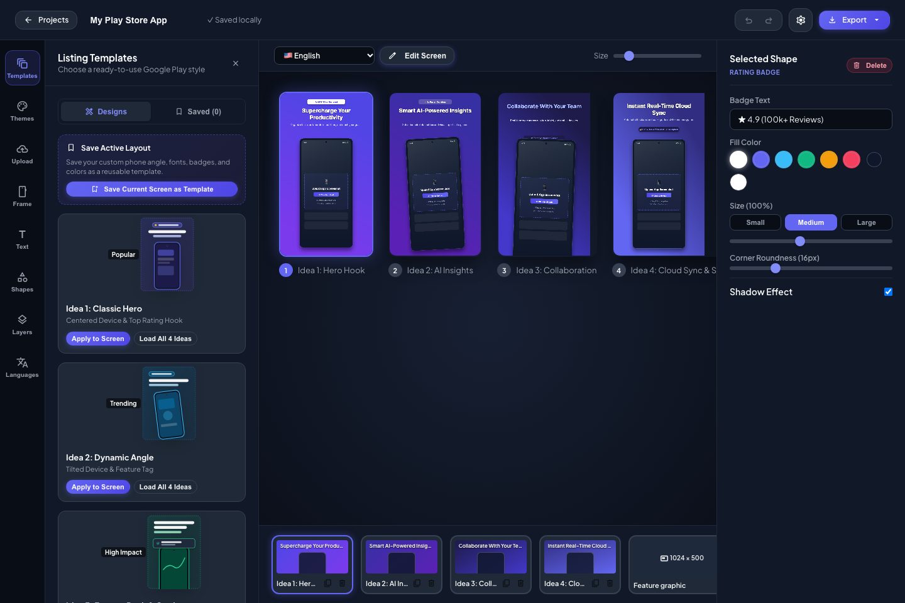

# AppScreen Studio 📱✨

[](LICENSE)
[]()
[]()

**AppScreen Studio** is a client-side web application and design suite for crafting high-converting Google Play Store listing screenshots, realistic device mockups, promotional badges, multilingual localized copies, and feature graphics.

Built entirely with **Vanilla JavaScript (ES Modules)**, **HTML5 Canvas**, and **Google Material Symbols**, backed by a lightweight file-based PHP API for automatic project persistence.

---

## 📸 Screenshots

| 🚀 Studio Dashboard | 📱 Modern SaaS Layout |
|:---:|:---:|
|  |  |

| 💎 Fintech Dark Theme | 🖼️ All Screens Overview |
|:---:|:---:|
|  |  |

---

## 🌟 Key Features

### 1. 📱 Realistic Device Mockups & Screenshots
- **Multiple Device Styles:**
  - Modern Android Flagship (punch-hole selfie camera, ultra-slim bezels)
  - Minimalist Slim Phone
  - Frameless Floating Screen (modern Play Store aesthetic)
  - Android Tablet Mockups (7-inch and 10-inch)
- **Multi-Device Canvas Support:** Add multiple phone mockups to a single screen, adjust independent positions, rotation, scaling, and z-index.
- **Screenshot Positioning:** Cover / Fill, Contain, vertical offsets, zoom scaling, and realistic drop shadow controls.

### 2. 🎨 Ready-Made Visual Badges & Floating Cards
- **Google Play Store Badges:**
  - `★ 4.9 (100k+ Reviews)`
  - `🚀 50M+ Downloads Worldwide`
  - `🏆 Google Play Editor's Choice`
  - `🛡️ Verified by Play Protect`
  - `★★★★★` (5 Golden Rating Stars)
- **Interactive UI Cards & Accents:**
  - Floating toast notifications (e.g., `🎉 Goal Achieved: 10,000 steps today!`)
  - Transaction status pills (e.g., `✓ Payment Confirmed: $128.50`)
  - Geometric shapes: Rounded rectangles, capsules, circles, glow accents, and organic blobs.
- **Full Styling Freedom:** Custom fill color, stroke color, border width, corner radius, drop shadow, and opacity.

### 3. ✍️ Typography & One-Click Style Presets
- **Google Fonts Library:** Plus Jakarta Sans, Inter, Poppins, Montserrat, Outfit, Cairo (Arabic), and more.
- **Unified Text Layers:** Add unlimited text layers with one-click typography presets:
  - **Headline Style:** Bold, prominent display (72px)
  - **Subtitle Style:** Clean, readable description (34px)
  - **Tag / Eyebrow:** Uppercase accent tag
  - **Promo Callout:** Punchy marketing banner
  - **Body / Caption:** Compact details
- **Precision Controls:** Font size, weight (400–900), alignment, line height, text shadows, and color swatches.

### 4. 🌍 Multilingual Copies & Easy Translation
- **Independent Language Copies:** Maintain dedicated screenshot sets for each language inside a single project.
- **Supported Languages:** English, Spanish, Arabic (with native RTL alignment!), French, German, Portuguese, Japanese, Hindi, Italian, Turkish, Indonesian, Russian.
- **Manual & AI Translation:**
  - Edit translated texts directly on canvas.
  - Or connect your Google Gemini, OpenAI, Claude, or DeepL API key to auto-translate all screens in one click.

### 5. 🖼️ Curated Palettes & 1024 × 500 Feature Graphic
- **Ready Color Palettes:** Electric Indigo, Cyber Emerald, Sunset Coral, Ocean Cyan, Obsidian & Gold, and Clean Light.
- **Save Custom Designs:** Save your unique canvas layouts and custom color palettes to reuse across projects.
- **Play Store Feature Graphic Editor:** Dedicated 1024 × 500 banner canvas with multi-screen showcase arrangement.

### 6. ⚡ Production-Ready Productivity Tools
- **Custom Context Menu:** Right-click anywhere on the canvas or elements to duplicate, delete, lock, hide, reorder layers, center, or reset rotation.
- **All Screens Overview:** Full listing overview grid to review your entire Play Store presentation side-by-side.
- **High-Resolution Export:** Instant export to Single PNG, Single JPEG, or a complete ZIP batch of all screens.
- **100% Serverless & Offline:** Zero backend or database required. All projects and assets auto-save to browser `IndexedDB` with instant `localStorage` caching and `.json` import/export.

---

## 🛠️ Architecture & Tech Stack

```
appscreen-studio/
├── index.html                  # Projects dashboard & template launcher
├── editor.html                 # Main studio interface
├── css/
│   ├── style.css               # Core layout, themes, and Material Symbols styling
│   └── components.css          # Modals, drawer tabs, context menus, and toolbars
├── js/
│   ├── app.js                  # Application bootstrap and controller
│   ├── state/                  # Reactive state management, store, and layer hierarchy
│   ├── canvas/                 # HTML5 2D canvas renderer, compose engine, and phone frames
│   ├── features/
│   │   ├── text/               # Font manager and typography presets
│   │   ├── shapes/             # Shape library, SVG paths, and badge definitions
│   │   ├── theme/              # Studio themes and curated color palettes
│   │   ├── templates/          # Ready listing templates and saved custom designs
│   │   ├── translation/        # Multi-language copy builder and AI translation service
│   │   ├── storage/            # Serverless IndexedDB & localStorage persistence engine
│   │   └── export/             # High-res canvas export and project JSON backup
│   └── ui/                     # Left drawer dock, inspector, context menu, filmstrip, modals
└── tests/                      # Automated unit test suite
```

- **Frontend:** Pure Vanilla JavaScript (ES6 Modules), HTML5 Canvas 2D API. No bundler or build step required!
- **Storage:** 100% client-side `IndexedDB` with `localStorage` instant cache and `.json` backup/restore.
- **Hosting:** 100% Static — deploy to GitHub Pages, Cloudflare Pages, Vercel, Netlify, or any static host with zero configuration.
- **Icons:** Google Material Symbols Outlined.

---

## 🚀 Getting Started

Because **AppScreen Studio** is completely serverless with zero build step, you can run it locally with any static HTTP server or open it directly:

### Option 1: Quick Local Server (Node.js)

```bash
git clone https://github.com/laith261/appscreen-studio.git
cd appscreen-studio
npm start
```

Or using `npx serve`:

```bash
npx serve .
```

Open `http://localhost:3000` (or the port shown in your terminal) in your browser.

### Option 2: Python Static Server

```bash
python3 -m http.server 8000
```

Open `http://localhost:8000` in your web browser.

### Option 3: GitHub Pages (Instant Cloud Hosting)

1. Go to your repository settings on GitHub (`Settings` > `Pages`).
2. Under **Build and deployment** > **Source**, select `Deploy from a branch`.
3. Choose branch `main` and folder `/(root)`.
4. Click **Save**. Your studio will be live at `https://laith261.github.io/appscreen-studio/`!

---

## 🧪 Running Tests

The test suite validates state persistence, multi-language copy isolation, context menu actions, and layer management:

```bash
npm test
```

Or run directly with Node:

```bash
node tests/store.check.mjs
node tests/persistence.check.mjs
node tests/translation_manual.check.mjs
node tests/context_menu.check.mjs
```

---

## ⌨️ Keyboard Shortcuts

| Shortcut | Action |
|---|---|
| `Ctrl + Z` / `Cmd + Z` | Undo |
| `Ctrl + Y` / `Cmd + Shift + Z` | Redo |
| `Delete` / `Backspace` | Delete selected element |
| `Alt + ↑` | Bring layer forward |
| `Alt + ↓` | Send layer backward |
| `Ctrl + +` / `Cmd + +` | Zoom In |
| `Ctrl + -` / `Cmd + -` | Zoom Out |
| `Ctrl + 0` / `Cmd + 0` | Fit to view |
| `Right Click` | Context menu (canvas or element actions) |

---

## 📄 License

This project is licensed under the [MIT License](LICENSE).
